# サークル活動受付・出席管理システム

サークルや団体のメンバー、活動日、当日の受付状況を一元管理する Flask 製Webアプリケーションです。ブラウザ向け管理画面に加え、モバイルアプリなどから利用できるトークン認証付きREST APIを備えています。

このアプリは、ローカル環境での実行を前提としたポートフォリオ用Webアプリです。セキュリティ上の理由から、現時点ではインターネット上への一般公開は行っていません。GitHubでは設計・実装内容をREADMEとソースコードで公開し、必要に応じてスクリーンショットやローカル環境での実演を行う想定です。

## 主な機能

- Webログイン（通常30分、「ログイン状態を保持する」場合は30日）
- Web画面からの新規ユーザー登録
- メールアドレスを使ったパスワード再設定（開発環境ではURLをターミナルへ出力）
- ログイン中ユーザーのアカウント設定（ユーザー名・メールアドレス・パスワード変更）
- 現在のパスワードと確認用文字列によるアカウントの論理削除（ユーザー・活動データは保持）
- パスワード変更時の発行済みAPIトークン失効
- Flask-WTFによるWebフォームのCSRF対策（REST APIはBearerトークン認証のため対象外）
- 活動ごとの操作ログ（操作ユーザー、日時、操作種別、対象、説明を最大100件表示）
- 活動ごとの権限管理（owner・staff・viewer）と複数ユーザーでの共同管理
- ユーザーごとの活動作成・編集・削除
- 活動ダッシュボードで、本日の受付状況、次回予定、直近5件の活動履歴を確認
- 出席率50%未満の要確認メンバーと、所属グループ・所属区分別の出席率をダッシュボードに表示
- メンバー管理（名前、所属グループ、所属区分、備考）
- UTF-8／UTF-8 BOM付きCSVによるメンバー一括登録とテンプレートCSVのダウンロード
- 活動日の個別追加・一括追加・編集・削除
- 受付済み／未受付の切り替え、受付時刻・備考の記録
- 名前検索、所属グループ・所属区分・受付状態による絞り込み
- 活動日ごとの受付状況をUTF-8 BOM付きCSVで出力
- 個人別、所属グループ別、所属区分別の出席率集計
- Bearerトークン認証付きREST API
- activity_usersとowner・staff・viewerによる活動単位のアクセス制御

メンバーの「所属グループ」はチーム、班、部署、パート、役割グループなどの団体内分類に利用できます。「所属区分」は期、学年、年度、OB/OG、参加区分、役職区分などを自由入力して分類するための項目です。

## 画面イメージ

画面のスクリーンショットは、個人情報を含まないデモデータを使用して撮影し、`docs/images/`へ配置しています。

### ログイン画面

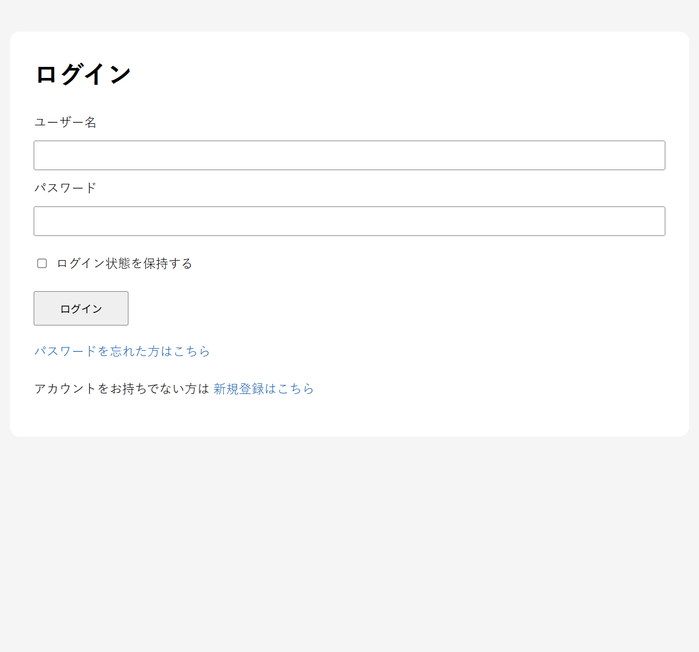

登録済みユーザーがログインする画面です。ログイン状態の保持、パスワード再設定、新規登録への導線があります。

### 新規登録画面

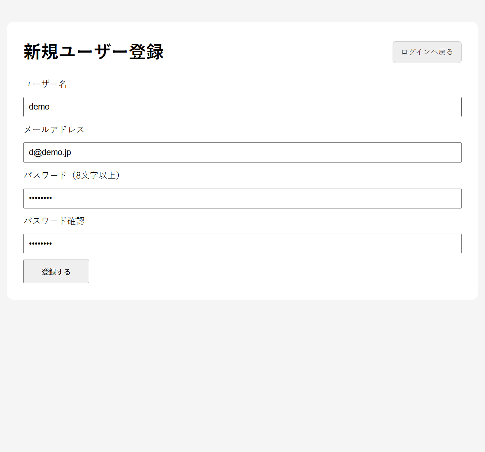

ブラウザからユーザー名、メールアドレス、パスワードを入力してアカウントを作成します。

### 活動一覧画面

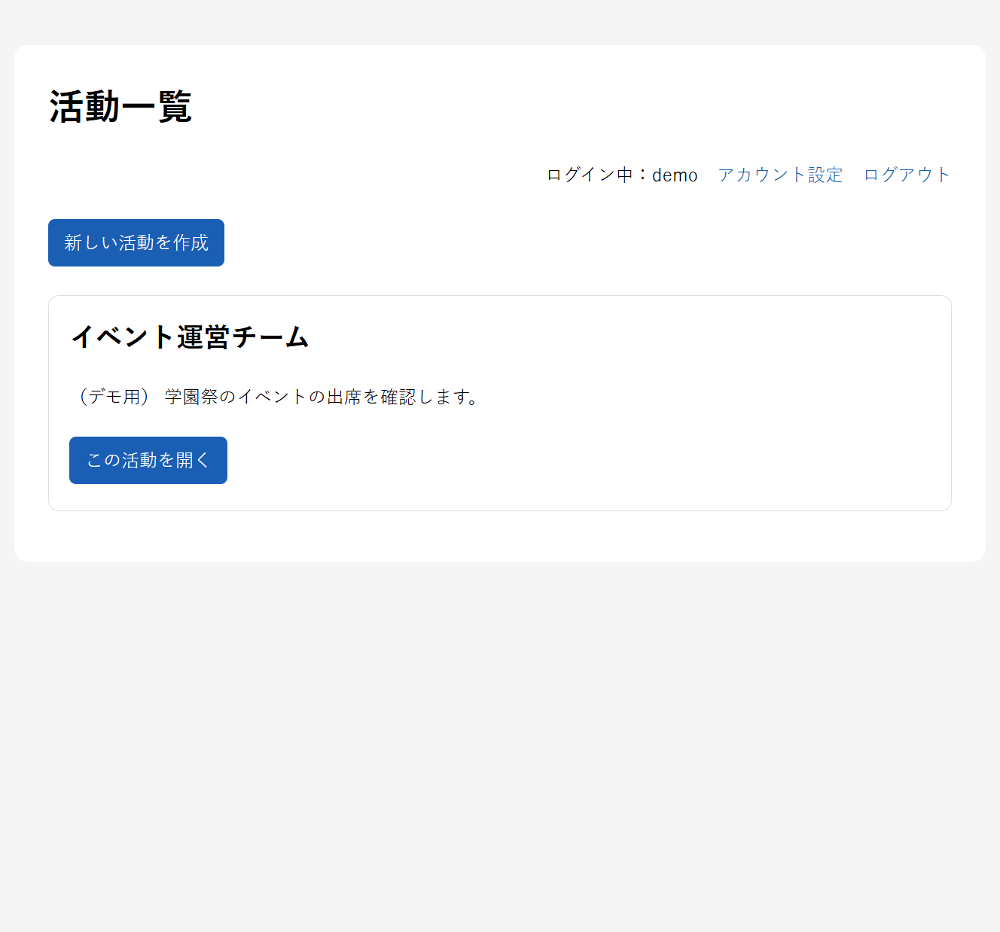

自分がowner・staff・viewerとして参加している活動を一覧表示します。新しい活動を作成したユーザーは自動的にownerになります。

### 活動ダッシュボード

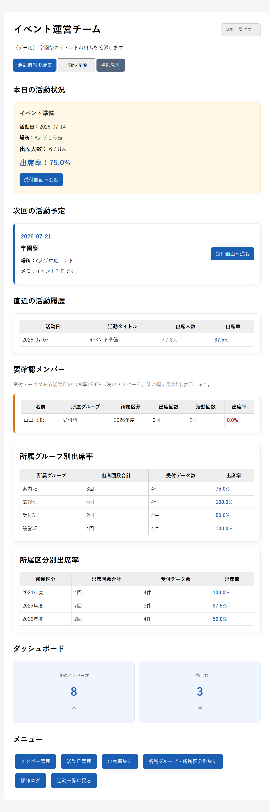

本日の出席状況、今日を除いた次回予定、直近の活動履歴、要確認メンバー、所属グループ・所属区分別の出席率を確認できます。

### メンバー管理画面

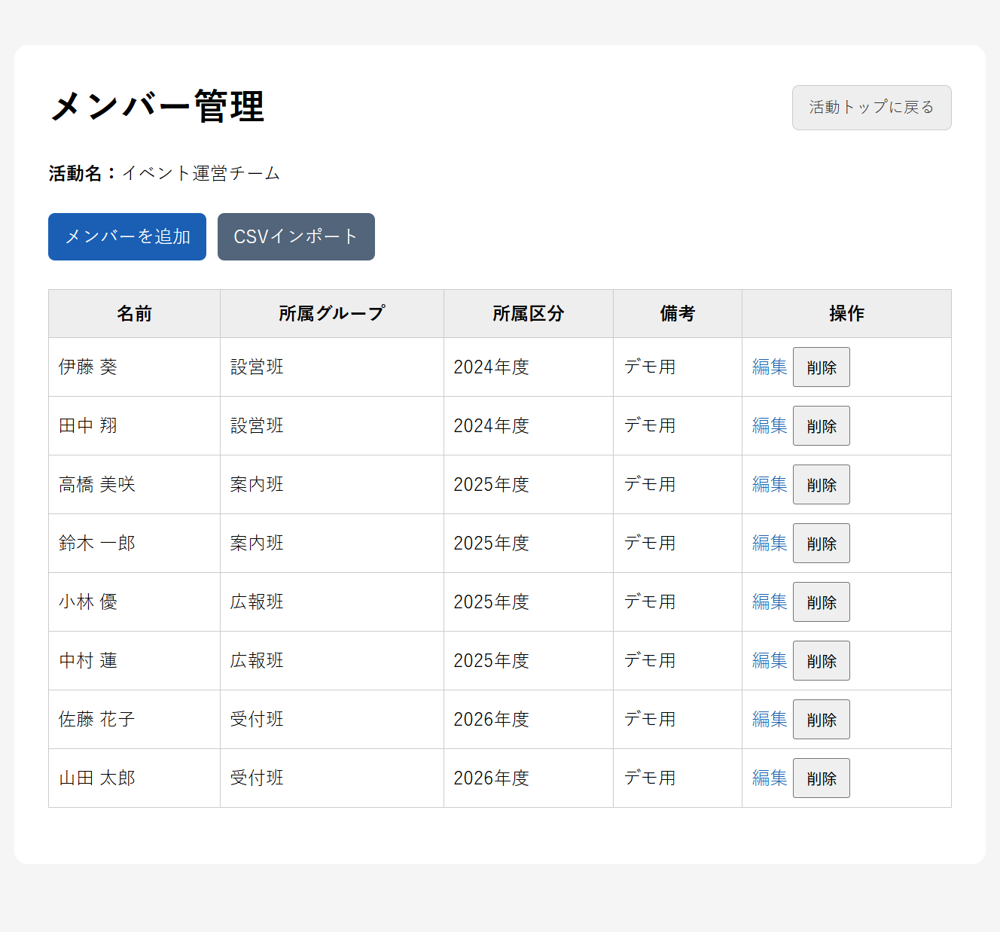

活動に所属するメンバーの一覧確認、追加、編集、削除を行います。操作ボタンは活動内の権限に応じて表示されます。

### CSVインポート画面

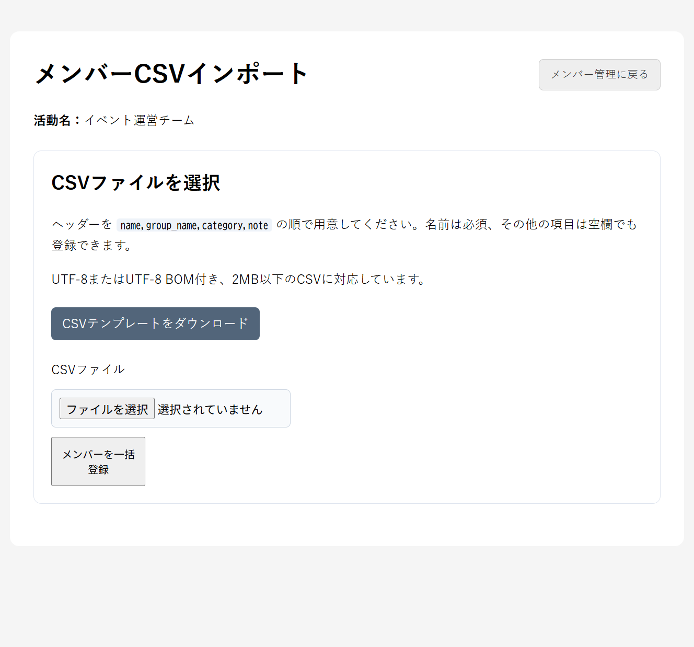

テンプレートCSVを利用して、メンバーをUTF-8またはUTF-8 BOM付きCSVから一括登録できます。

### 活動日管理画面

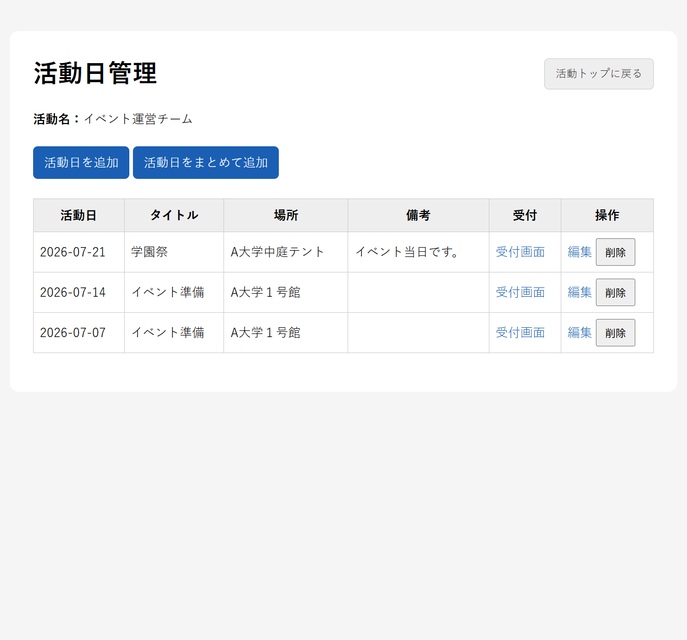

活動日の一覧確認、個別・一括追加、編集、削除を行い、対象日の受付画面へ移動できます。

### 受付画面

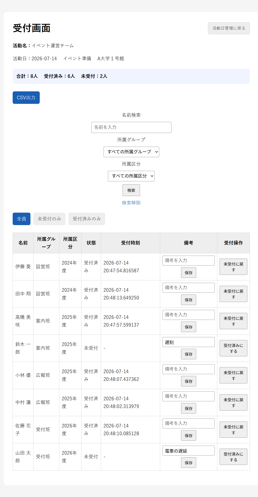

活動日ごとに受付済み・未受付を切り替え、受付時刻や備考を記録します。名前や所属、受付状態による絞り込みにも対応しています。

### 権限管理画面

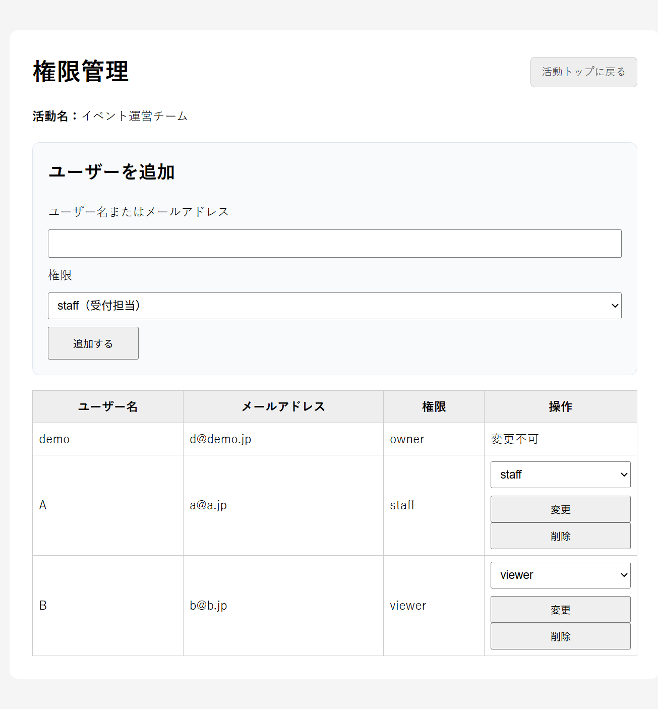

活動のownerが既存ユーザーを検索し、staffまたはviewerの権限を付与・変更・削除します。

### 操作ログ画面

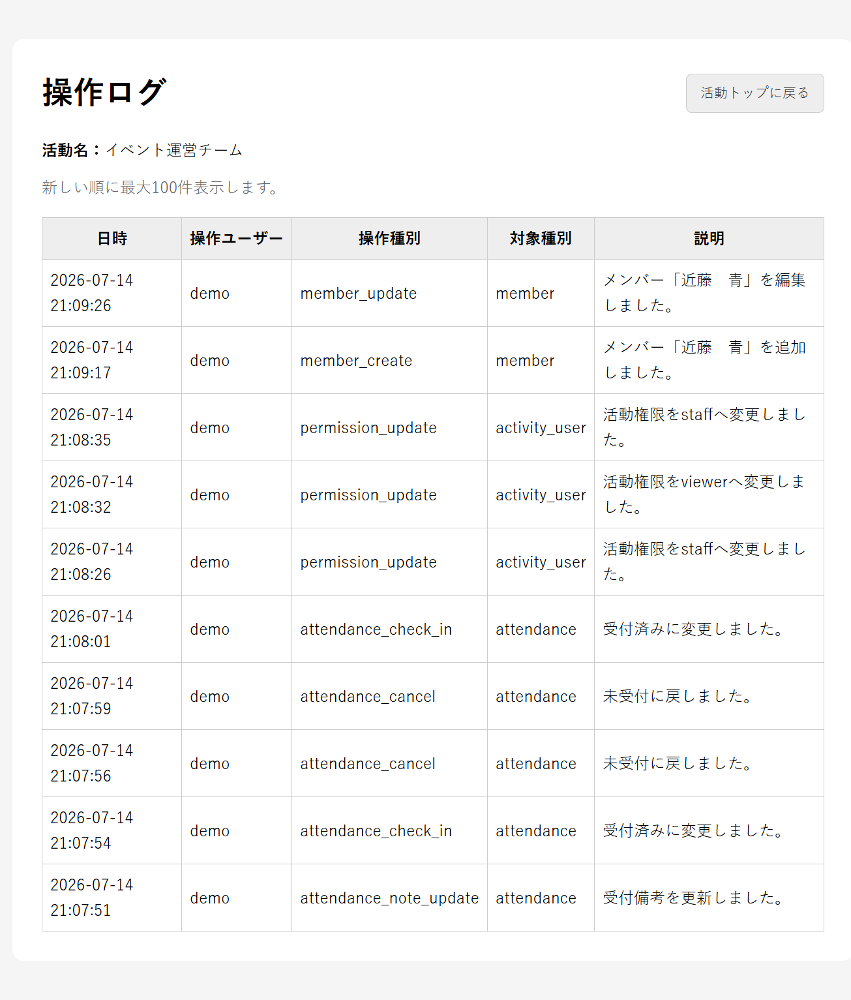

活動ごとに、誰が・いつ・何を操作したかを新しい順に最大100件確認できます。

### アカウント設定画面

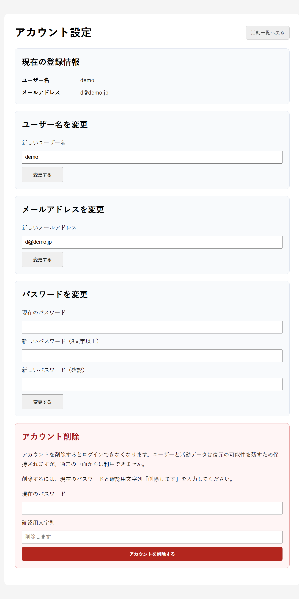

ユーザー名、メールアドレス、パスワードの変更と、パスワード・確認用文字列を使ったアカウントの論理削除を行います。

### 出席率集計画面

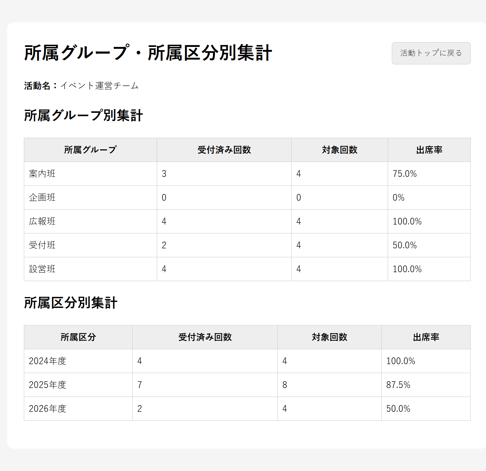

個人別、所属グループ別、所属区分別の出席率を確認できます。

## 使用技術

| 分類 | 技術 |
| --- | --- |
| バックエンド | Python / Flask |
| データベース | PostgreSQL / psycopg2 |
| フロントエンド | HTML / CSS / Jinja2 |
| 認証 | Flask Session / API Bearer Token |
| パスワード | Werkzeug password hash |
| CSV出力 | Python標準ライブラリ `csv` |

## プロジェクト構成

```text
attend_app/
├── app.py                 # Web画面・REST API本体
├── create_admin.py        # 初期ユーザー作成スクリプト
├── .env.example           # 環境変数の公開用サンプル
├── .gitignore             # Git管理対象外の設定
├── requirements.txt       # Python依存パッケージ
├── schema.sql             # PostgreSQLテーブル作成SQL
├── API仕様.md              # REST APIの詳細
├── docs/images/           # ポートフォリオ用スクリーンショット
├── templates/             # Jinja2テンプレート
├── static/style.css       # 画面スタイル
└── csv/.gitkeep           # CSV保存先の空フォルダを維持
```

## セットアップ

### 1. 前提ソフトウェア

- Python 3.10以上
- PostgreSQL
- pip

### 2. 仮想環境と依存パッケージ

PowerShellでプロジェクトのルートに移動し、次を実行します。

```powershell
python -m venv .venv
.\.venv\Scripts\Activate.ps1
python -m pip install --upgrade pip
pip install -r requirements.txt
```

### 3. データベース作成

PostgreSQLで `attend_app_db` を作成し、そのデータベースに接続してテーブルを作成します。

```sql
CREATE DATABASE attend_app_db;
```

作成したデータベースに対して、プロジェクト直下の `schema.sql` を実行します。

```powershell
psql -U postgres -d attend_app_db -f schema.sql
```

pgAdminを使用する場合は、`attend_app_db` を選択してクエリツールを開き、`schema.sql` の内容を実行してください。

テーブルの関係は次のとおりです。

```text
users
├── activities ─── activity_users ─── users
│   ├── members ─────┐
│   └── sessions ────┴── attendance
│   └── audit_logs
├── api_tokens
└── password_reset_tokens
```

`schema.sql` は空のデータベースへ新規作成するときに使用します。既存テーブルがあるデータベースにそのまま再実行するとエラーになるため、作り直す場合は先頭の `DROP TABLE IF EXISTS` のコメントを外してください。この操作では既存データがすべて削除されます。

既存DBを引き続き使用する場合は、メンバー分類カラムを新しい名称へ変更します。カラム名の変更なので、登録済みの値はそのまま引き継がれます。

```sql
ALTER TABLE members RENAME COLUMN part TO group_name;
ALTER TABLE members RENAME COLUMN generation TO category;
ALTER TABLE members ALTER COLUMN category TYPE VARCHAR(100);
```

3行目は、従来 `VARCHAR(20)` だった所属区分を自由入力しやすい `VARCHAR(100)` へ拡張する処理です。

論理削除方式のアカウント削除を既存DBへ追加する場合は、次のSQLを一度だけ実行してください。

```sql
ALTER TABLE users ADD COLUMN is_active BOOLEAN NOT NULL DEFAULT TRUE;
ALTER TABLE users ADD COLUMN deleted_at TIMESTAMP;
```

操作ログ機能を既存DBへ追加する場合は、次のSQLを一度だけ実行してください。

```sql
CREATE TABLE audit_logs (
    id SERIAL PRIMARY KEY,
    user_id INTEGER REFERENCES users(id) ON DELETE SET NULL,
    activity_id INTEGER REFERENCES activities(id) ON DELETE CASCADE,
    action VARCHAR(100) NOT NULL,
    target_type VARCHAR(100),
    target_id INTEGER,
    description TEXT,
    created_at TIMESTAMP DEFAULT CURRENT_TIMESTAMP
);

CREATE INDEX idx_audit_logs_activity_created_at
    ON audit_logs(activity_id, created_at DESC);
```

活動権限機能を既存DBへ追加する場合は、次のSQLを一度だけ実行してください。`activities.user_id`は作成者情報として残ります。

```sql
CREATE TABLE activity_users (
    id SERIAL PRIMARY KEY,
    activity_id INTEGER NOT NULL REFERENCES activities(id) ON DELETE CASCADE,
    user_id INTEGER NOT NULL REFERENCES users(id) ON DELETE CASCADE,
    role VARCHAR(20) NOT NULL CHECK (role IN ('owner', 'staff', 'viewer')),
    created_at TIMESTAMP DEFAULT CURRENT_TIMESTAMP,
    UNIQUE(activity_id, user_id)
);

CREATE INDEX idx_activity_users_user_id ON activity_users(user_id);
CREATE INDEX idx_activity_users_activity_id ON activity_users(activity_id);

INSERT INTO activity_users (activity_id, user_id, role)
SELECT id, user_id, 'owner'
FROM activities
ON CONFLICT (activity_id, user_id) DO NOTHING;
```

### 4. 接続設定

初回セットアップ時は `.env.example` を `.env` にコピーします。

```powershell
Copy-Item .env.example .env
```

作成した `.env` をローカル環境に合わせて編集してください。

```dotenv
SECRET_KEY=十分に長いランダムな文字列
DB_HOST=localhost
DB_NAME=attend_app_db
DB_USER=postgres
DB_PASSWORD=PostgreSQLのパスワード
DB_PORT=5432
FLASK_DEBUG=false
SESSION_COOKIE_SECURE=false
```

`.env` は `.gitignore` の対象であり、GitHubには公開しません。`.env.example` には実際のパスワードや秘密鍵を記載しないでください。

`FLASK_DEBUG` はローカルでも通常 `false` にします。HTTPSで本番運用する場合は `SESSION_COOKIE_SECURE=true` を指定してください。

### 5. ユーザー作成

通常は、ブラウザから新規ユーザー登録を行います。
アプリを起動後、以下にアクセスします。


```text
http://127.0.0.1:5000/register
```

また、CLIから初期ユーザーを作成したい場合は、以下の補助スクリプトを利用できます。

```PowerShell
python create_admin.py
```

表示される案内に従って、ユーザー名、メールアドレス、パスワードを入力します。
パスワードはハッシュ化して保存されます。

### 6. アプリケーション起動

```powershell
python app.py
```

ブラウザで <http://127.0.0.1:5000/login> を開き、作成したユーザーでログインします。同一ネットワーク上の端末から試す場合は、PCのIPアドレスとポート `5000` を指定してください。

本アプリはローカル実行を前提としているため、確認終了後はターミナルで `Ctrl+C` を押してFlask開発サーバーを停止してください。

## 基本的な使い方

ログイン画面の「新規登録はこちら」からユーザーを作成できます。登録直後はどの活動にも所属しておらず、自分で活動を作成すると自動的にownerになります。既存活動へ参加する場合は、その活動のownerが権限管理画面からstaffまたはviewerとして追加します。

1. ログイン後、活動を作成します。
2. 活動のダッシュボードからメンバーと活動日を登録します。
3. 対象の活動日の受付画面を開き、参加者を受付済みにします。
4. 必要に応じて備考を入力し、CSV出力や出席率集計を利用します。

受付画面を初めて開いた時点で、その活動に所属する全メンバーの未受付データが自動作成されます。後から追加したメンバーも、受付画面を再度開くと追加されます。

各活動のダッシュボードにある「操作ログ」から、その活動に関する直近100件の操作を新しい順に確認できます。他ユーザーが所有する活動のログは表示されません。

活動作成者は自動的にownerになります。ownerは活動ダッシュボードの「権限管理」から、既存ユーザーをユーザー名またはメールアドレスで検索し、staffまたはviewerとして追加できます。

| 操作 | owner | staff | viewer |
| --- | :---: | :---: | :---: |
| 活動・メンバー・活動日・集計・操作ログの閲覧 | ✓ | ✓ | ✓ |
| メンバーと活動日の追加・編集、受付操作、CSV入出力 | ✓ | ✓ | - |
| 活動編集・削除、メンバー削除、活動日削除、権限管理 | ✓ | - | - |

活動一覧上部の「アカウント設定」から、現在のユーザー名とメールアドレスを確認・変更できます。パスワード変更には現在のパスワードが必要です。パスワードを変更すると、セキュリティのため、そのユーザーに発行済みのAPIトークンはすべて失効します。APIを引き続き利用する場合は `POST /api/login` で新しいトークンを取得してください。

アカウント設定から自分のアカウントを削除できます。削除には現在のパスワードと確認用文字列「削除します」が必要です。アカウント削除は物理削除ではなく、`users.is_active=false`と`deleted_at`を設定する論理削除です。ユーザーと活動データは保持され、APIトークンとパスワード再設定トークンは削除されます。論理削除されたユーザーはWeb・APIのどちらからもログインできません。

## REST API

APIのベースURLは `http://127.0.0.1:5000` です。  
最初に `POST /api/login` でAPIトークンを取得し、以後のリクエストでは次のように `Authorization` ヘッダーへトークンを付与します。

```http
Authorization: Bearer YOUR_TOKEN
```

```powershell
$body = @{ username = "admin"; password = "password" } | ConvertTo-Json

$login = Invoke-RestMethod `
  -Method Post `
  -Uri "http://127.0.0.1:5000/api/login" `
  -ContentType "application/json" `
  -Body $body

$headers = @{ Authorization = "Bearer $($login.data.token)" }

Invoke-RestMethod `
  -Uri "http://127.0.0.1:5000/api/activities" `
  -Headers $headers
```

全エンドポイント、入力項目、レスポンス例は [API仕様.md](API仕様.md) を参照してください。

## CSV出力

CSVには活動日、活動名、氏名、所属グループ、所属区分、受付状態、受付時刻、備考が含まれます。Excelで文字化けしにくいUTF-8 BOM付きで生成され、`csv/` に保存された後にダウンロードされます。

## メンバーCSVインポート

メンバー管理画面からCSVをアップロードし、複数のメンバーを一括登録できます。CSVはUTF-8またはUTF-8 BOM付きで、ヘッダーは `name,group_name,category,note` としてください。`name` は必須で、空欄の行は理由と行番号を表示してスキップします。`group_name`、`category`、`note` は空欄でも登録できます。

メンバーCSVインポート画面から、Excelで文字化けしにくいUTF-8 BOM付きのサンプル入りテンプレートCSVもダウンロードできます。実在する個人情報を含むCSVは使用せず、インポート後のローカルDBにもデモデータだけを登録してください。

## デモ用データについて

- 本物の個人情報や実在するメンバー情報は登録しません。
- GitHub掲載用の画面では、架空のサンプルデータだけを使用します。
- デモ用ユーザーは `python create_admin.py` を実行してローカルDBに作成します。
- ローカルDBの内容や生成したCSVはGitHubへ公開しません。

## 公開方針

- GitHubでは、ソースコード、README、API仕様、DBスキーマ、依存関係、環境変数のサンプルを公開します。
- アプリの実行と動作確認はローカル環境を前提とし、現時点ではWebデプロイを行いません。
- DBパスワードや秘密鍵を含む `.env` は公開しません。
- 実データや個人情報を含むCSV、ローカルDB、仮想環境、キャッシュは公開しません。
- 面接やポートフォリオでは、README、スクリーンショット、必要に応じたローカル実演で紹介します。
- 将来本番公開する場合は、レート制限、HTTPS、セキュアCookie、本番用WSGIサーバー、監視・バックアップなどの追加対応が必要です。

## セキュリティと運用上の注意

現在の設定はローカル実行用です。将来本番運用する場合は、少なくとも次の対応が必要です。

- 本番環境では `.env` を配布せず、ホスティング環境のシークレット管理機能を使用する
- `FLASK_DEBUG=false` に設定し、本番用WSGIサーバーを使用する
- HTTPSを有効にする
- セッションCookieへ `Secure`、`HttpOnly`、`SameSite` を適切に設定する
- WebフォームのCSRF対策を維持し、`SECRET_KEY` を安全に管理・定期更新する
- APIの入力値検証、レート制限、トークン失効管理を強化する
- 定期的なバックアップとログ管理を行う

APIトークンの有効期限は発行から30日です。DBには平文トークンではなくSHA-256ハッシュが保存され、`POST /api/logout` で現在のトークンを削除できます。

## 現在の制約

- APIには新規ユーザー登録エンドポイントはありません。ユーザー登録はWeb画面から行います。
- CLIから初期ユーザーを作成したい場合は、`python create_admin.py` を利用できます。
- APIには活動日の一括登録、メンバーCSVインポート、CSV出力のエンドポイントはありません。これらはWeb画面から利用します。
- 出席率は、受付データが作成済みの活動日を母数として計算します。
- アカウント削除は物理削除ではなく論理削除です。復元する場合は、管理者がDB上で `is_active` と `deleted_at` を更新する必要があります。
- 論理削除後もユーザー名とメールアドレスの一意制約は維持されるため、同じ値での再登録はできません。
- 自動テストと自動DBマイグレーションは未導入です。
- 本番公開する場合は、メール送信機能、レート制限、バックアップ設計、ログ保存期間の設計などを追加する必要があります。